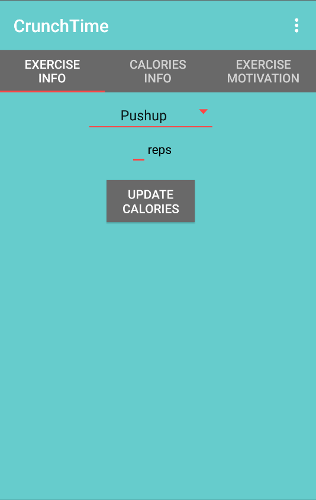
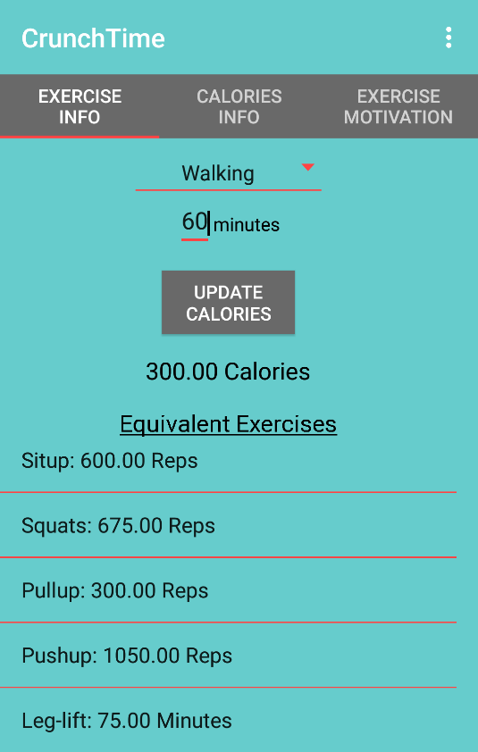
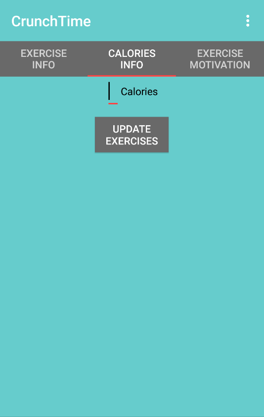
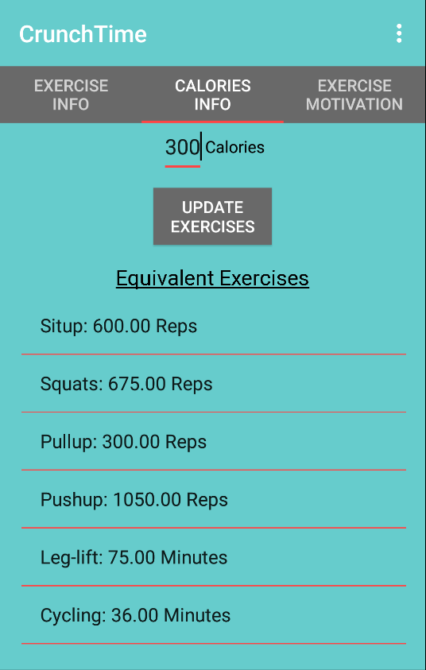
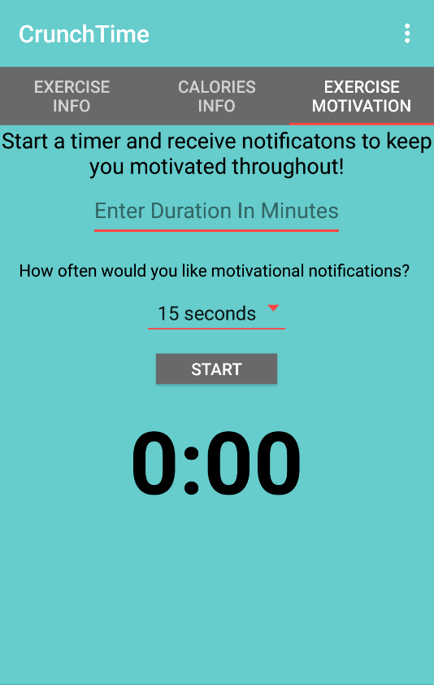
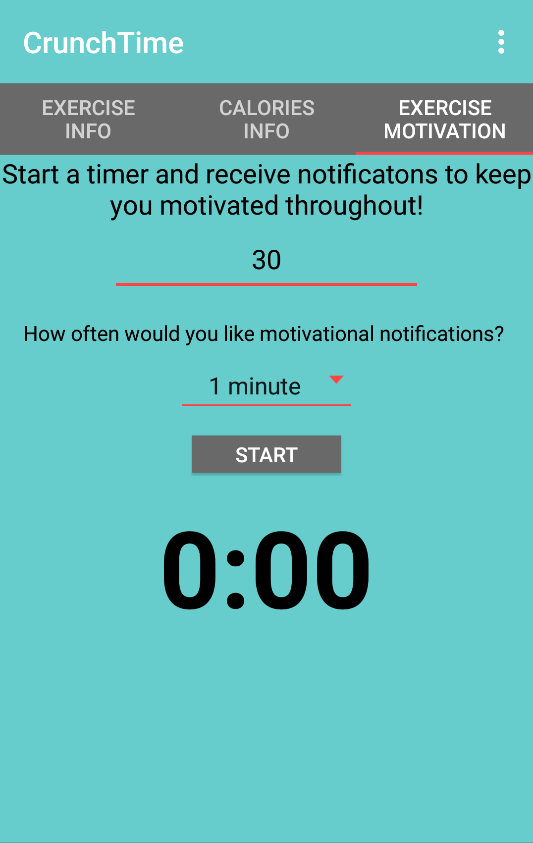
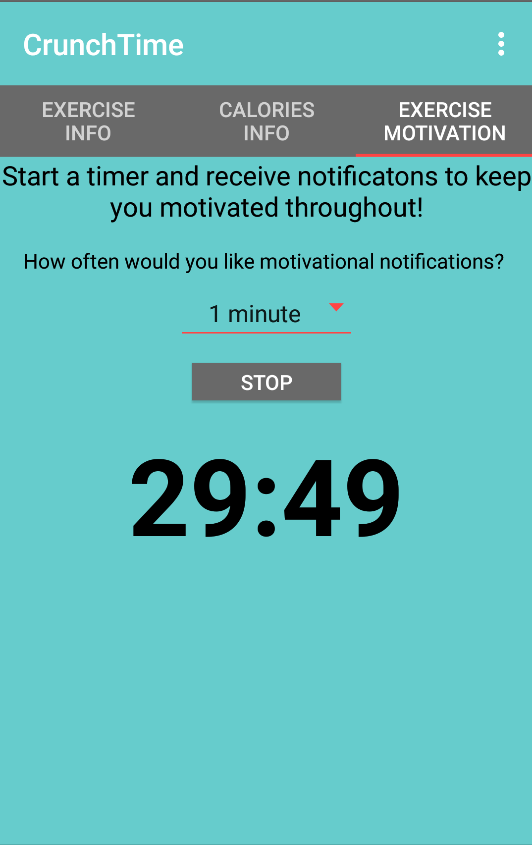
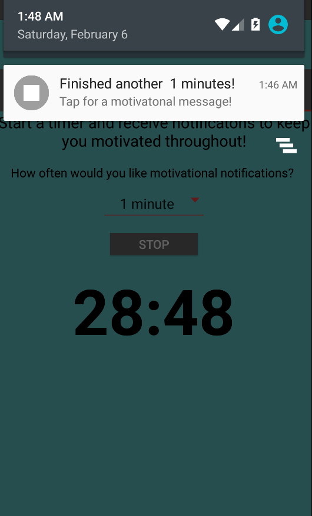
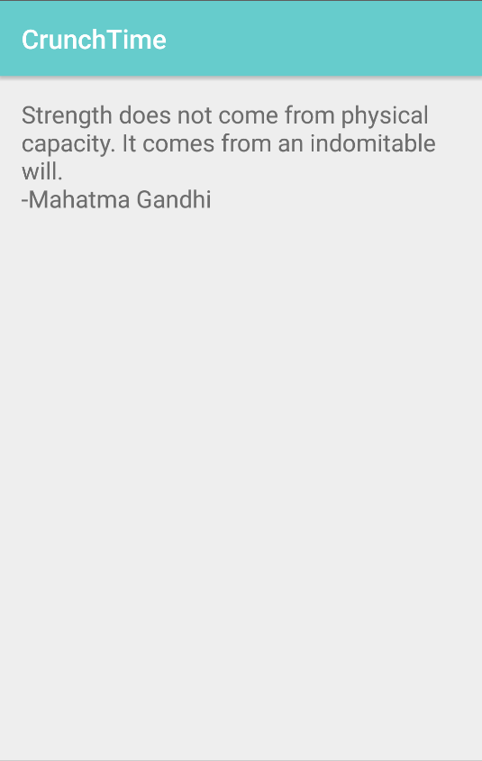

# PROG 01: Crunch Time

The application is an exercise to calorie converter and a calorie to exercise converter. A user choose a particular exercise and the number of reps/minutes to find out the number of calories burned as well as an equivalent amount of other exercises to burn the same number of calories. A user can also enter how many calories they want to burn and get a list of exercises and corresponding reps/minutes to burn that many calories. Finally, a user can start a timer for his workout and receive motivational message notifications along the way.

## Authors

Mukund Chillakanti ([mukundc@berkeley.edu](mailto:your_email@berkeley.edu))

## Demo Video

See [Workout Conversions] (https://youtu.be/UWVb6Un-tBI)

## Screenshots

## Acknowledgments
